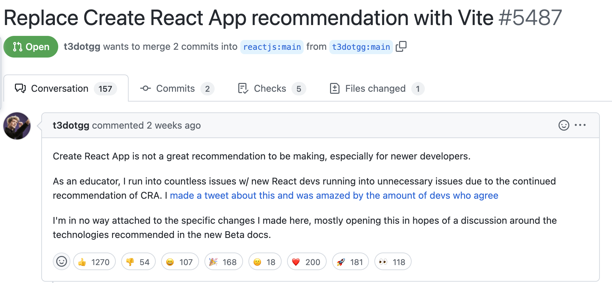

# 학습 키워드

- Node.js
- NPM(Node Package Manager)
  - package.json / package-lock.json
  - node_modules
  - npx
- ES Modules vs CommonJS

## 강의 정리

### 개발환경 세팅

Node.js로 개발을 한다. toolchain이라고 부르는 개발 환경, 도구들의 모음을 Node.js로 쓴다.  
Deno를 사용하면 훨씬 간단하지만, 대부분의 서비스들은 Node.js로 구축되어 있기 때문에  
Node.js 기반으로 세팅을 할 것.
하지만 Node.js를 통한 개발 환경 세팅은 생각보다 까다롭다.

어려운 이유는 도구가 계속 변화하기 때문이다. 새로운 도구가 나오면 그곳으로 쏠리고 계속 변화한다.(CRA -> Vite) 여기에서는 전체적인 흐름을 다룬다. 새로운 도구가 나오면 이렇게 써봐야지, 이런건 이러한 문제를 해결하려고 나왔구나 등의 접근을 해보는 것이 좋다. 새로운 기술을 명목적으로 쫒을 필요는 없지만, 항상 뒤쳐지지 않게 트렌드에는 민감하자. 실질적으로 좋은 것이 있다면 도입하자. trade-off를 고려하자.

지금의 세팅도 나중에는 조금씩 달라질 것이다.  
바뀐 부분이 있으면 문서를 찾아서 업데이트 하면 되고 새로운 도구를 선택할 수도 있다.

### JavaScript 개발 환경 (Node.js) 세팅

사실상 Node.js 세팅이다  
대부분 밑바닥부터 만드는 프로그램은 없고 이미 만들어놓은 툴들을 사용해서 개발을 하기 때문이다.  
nvm을 쓰다가 최근에는 fnm을 쓴다. nvm보다 빠르다  
(Rust로 만들어졌다)

node.js 페이지에서 버전을 확인할 수 있다.  
공식문서는 영어가 업데이트라던가 조금은 더 빠를 수 있다.  
(개인적으로는 영어로 보는 것을 좋아한다)

LTS (Long Term Support)

노드 버전 앞이 홀수인 것은 최신버전, 짝수인 것은 LTS 버전

### TypeScript + React + Jest + ESLint + Parcel(번들러, 빌드 도구, 만능 도구) 개발 환경 세팅

작업 폴더 준비

- mkdir my-all
- cd my-app

편집기(VSCode) 열기

- code .
- webstorm . (웹스톰)

npm 패키지 준비

- npm init
- npm init -y (한번에 package.json 생성)
- name은 kebab-case, Lisp-case
- version은 semantic versioning
  - major.minor.patch

.gitignore 세팅

- touch .gitignore
- node_modules/
- dist/
- github/gitignore 혹은 vscode에서 .gitignore을 생성하면 편리하다.

타입스크립트 설정

- npm i -D typescript
  - -D 옵션은 package.json의 devDependencies에 설치된다.
  - 개발 환경에서만 사용되는 툴
  - 과거에는 npm i --save-dev
- npx tsc --init
  - node_modules/.bin/tsc --init 명령어와 같다.
  - npx는 node_modules에 해당하는 패키지가 설치되어 있으면 찾아서 실행하고, 만약 설치되어 있지 않더라도 npm 패키지들을 캐시하는 곳에 다운로드를 받아서 설치하지 않아도 사용할 수 있도록 해준다.
    - macOS의 경우에 ~/.npm/\_npx 에 존재한다.
  - "jsx" : "react-jsx" 설정을 맞춰준다.
    - .tsx 파일을 사용하게 해준다.
    - import React를 하지 않아도 사용할 수 있게 해준다.

ESLint 설정

- npm i -D eslint
- npx eslint --init
- env에 jest:true를 미리 잡아줄 것.
- .eslintignore 작성

리액트 설치

- npm i react react-dom
- npm i -D @types/react @types/react-dom

테스팅 도구 설치

- npm i -D jest @types/jest @swc/core @swc/jest \
   jest-environment-jsdom \
   @testing-library/react @testing-library/jest-dom

jest.config.js 설정

- 성능을 위해 테스트에서 SWC를 사용할 수 있도록 세팅

Parcel 설치

- npm i -D parcel
- package.json scripts 수정

---

## 만들어진 개발 환경 (React)

- CRA (Create-React-App)
  - npx create-react-app my-app --template typescript
- Vite
  - yarn create vite
- CNA (Create-Next-App)
  - npx create-next-app@latest

CRA는 이제 자리에서 물러나고 Vite가 자리를 차지한 것 같다.  
개발 환경에서의 HMR(Hot Module Reloading), build 속도가 매우 빠르다. 번들이 없는 개발 서버다.

(React Docs BETA에서는 아직 CRA를 추천하고 있는데... Vite로 변경해달라는 pr에 박힌 이모지)

Next로 개발을 할 때는 CNA를 사용하여 프로젝트를 구성한다.

간단하게 사용하기에는 괜찮지만, 규모가 있는 서비스를 제작하게 된다면 개발환경을 직접 구축하는 것이 강점을 가진다고 생각한다. 커스텀하는 부분에서 귀찮고 어려움이 많이 생기는 것 같다.

그리고 의존하는 것이 아닌, 내가 코드를 작성 할 개발 환경을 직접 구축해보는 것은 무조건 필요한 일이다. 남이 만들어준 환경에서만 개발을 할 수 있는 사람은 개발자라고 할 수 있을까?
